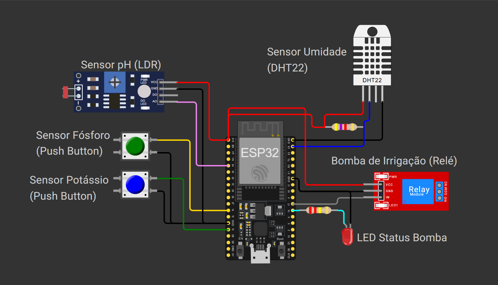

# Sistema de Irrigação Inteligente – FarmTech Solutions

**Caio Pellegrini - RM566575**

## Descrição do Projeto
Este projeto simula um sistema de irrigação inteligente para agricultura de precisão, utilizando sensores físicos integrados a um microcontrolador ESP32. O objetivo é coletar dados de sensores de umidade, nutrientes e pH do solo, controlar automaticamente uma bomba de irrigação e armazenar os dados em um banco de dados SQL para análise posterior.

---

## 1. Circuito e Componentes

O circuito foi desenvolvido e simulado na plataforma Wokwi, utilizando os seguintes componentes:

- ESP32: Microcontrolador responsável pela leitura dos sensores e controle do relé.
- Sensor de Umidade (DHT22): Mede a umidade do solo.
- Sensor de pH (LDR): Simula variações de pH através da luminosidade.
- Sensor de Fósforo (Botão): Simula presença/ausência de fósforo (pressionado = presença).
- Sensor de Potássio (Botão): Simula presença/ausência de potássio (pressionado = presença).
- Relé: Controla a bomba de irrigação.
- LED: Indica o status da bomba (ligado = irrigação ativa).

### Imagem do Circuito




## 2. Lógica de Controle de Irrigação

A bomba de irrigação é ativada somente quando **três condições** são simultaneamente atendidas:

1. **Umidade do solo abaixo do limite definido**  
   - Isso indica que o solo está seco e necessita de água.

2. **Pelo menos um dos nutrientes (fósforo ou potássio) está presente**  
   - Nutrientes são essenciais para o crescimento das plantas. Se ambos estiverem ausentes, a irrigação não será eficaz, pois a planta não conseguirá absorver o que precisa para se desenvolver, mesmo com água.

3. **O pH do solo está dentro da faixa adequada**  
   - O pH influencia diretamente na capacidade da planta de absorver nutrientes. Se estiver fora da faixa ideal (muito ácido ou muito básico), a irrigação pode piorar o desequilíbrio e prejudicar ainda mais o solo.

Caso **qualquer uma dessas condições não seja atendida**, a bomba é desativada automaticamente. O status da bomba é indicado por um LED.

**Trecho do código comentado:**

```cpp
// Avaliação das condições para irrigação:
// 1. Umidade abaixo do ideal
// 2. Presença de pelo menos um dos nutrientes
// 3. pH dentro da faixa adequada
isUmidadeBaixa = umidade < 42.0;
isNutrientePresente = temFosforo || temPotassio;
phAdequado = ph >= 5.9 && ph <= 7.6;

// Verifica se todas as condições estão satisfeitas para irrigação
if (isUmidadeBaixa && isNutrientePresente && phAdequado) {
   // Ativa a bomba d'água (RELE em LOW) e acende o LED indicador
   digitalWrite(RELE_PIN, LOW);
   digitalWrite(LED_PIN, HIGH);
   ...
}
```

### Explicação do Código C++ (ESP32):

O código lê sensores simulados de umidade, pH e nutrientes e envia esses dados em formato JSON pela porta serial. Ele verifica se as condições para irrigação estão atendidas e, se sim, ativa a bomba de água por 5 segundos, indicando o estado com um LED e registrando a aplicação.

### Explicação do Código Python (Backend):

O código conecta-se ao ESP32 via serial para receber os dados JSON, processa as leituras e registros de irrigação, armazena tudo em um banco de dados, exibe informações no console e, ao ser interrompido, atualiza dados, lista registros e fecha as conexões corretamente.


## 3. Banco de Dados SQL e Operações CRUD

Os dados coletados pelo ESP32 são enviados via monitor serial e armazenados em um banco de dados SQLite utilizando Python.

### Estrutura do Banco de Dados:
- Tabela *plantacoes*: Cadastro das plantações monitoradas.
- Tabela *sensores*: Cadastro dos sensores instalados.
- Tabela *leituras_sensores*: Armazena as leituras dos sensores (umidade, pH, fósforo, potássio, data/hora).
- Tabela *aplicacoes_agua*: Registra as aplicações de água em determinada plantação por um período de tempo.

### Atributos e MER


### Cardinalidades
| Relacionamento | Tipo | Cardinalidade |
| --- | --- | --- |
| Sensor — Leitura_Sensor | 1:N | Um **sensor** pode realizar *múltiplas* **leituras**. Cada **leitura** pertence a *somente um* **sensor**.  |
| Plantacao — Leitura_Sensor | 1:N | *Uma* **plantação** pode ter *várias* **leituras de sensores** ao longo do tempo. Cada **leitura de sensor** pertence a **uma única plantação**. |
| Plantacao — Aplicacao_Agua | 1:N | Uma **plantação** pode ter *múltiplas* **aplicações de água**. Cada **aplicação d’água** pertence à *apenas uma* **plantação**. |

### Operações CRUD
O script Python implementa as operações básicas:

- Create: Inserção de novas plantações, sensores, leituras e aplicações d'água.
- Read: Consulta de plantações, aplicações, leituras e leituras por período.
- Update: Atualização de dados de plantações ou sensores.
- Delete: Remoção de sensores, plantações ou leituras.

#### Exemplos de Uso
```python
# Create
inserir_plantacao(db, ("Plantação A", "2025-05-01", "2025-06-01", "Milho", "Monte Alto - SP"))

# Read
print(listar_plantacoes(db)) # [('Plantação A', '2025-05-01', '2025-06-01', 'Milho', 'Monte Alto - SP')]

# Update
atualizar_sensor(db, 1, ("umidade", "dht22", "%"))

# Delete
deletar_leitura(db, 5)
```

Veja todas as operações CRUD no arquivo `backend/crud.py`

## 4. Como Executar

### ESP32 (Wokwi/PlatformIO)
1. Abra o projeto no VS Code/Arduino IDE.
2. Compile e faça upload do código para o ESP32.

### Python (Banco de Dados)
1. Conecte à porta Serial/COM do ESP32.
2. Configure a porta no script.
3. Execute o script Python em backend para inserir e manipular os dados no banco SQLite.

## 5. Organização do Repositório

```bash
├── esp32/      # Código do ESP32
├── backend/    # Scripts Python (banco de dados)
├── docs/       # Documentação e imagens
└── README.md   # Arquivo de descrição do projeto
```

## 6. Demonstração

[Assista ao vídeo de demonstração/explicativo](https://youtu.be/nUFCEL9oX0c)

[](https://youtu.be/nUFCEL9oX0c)


## 7. Créditos
- Curso: Inteligência Artificial
- Instituição: FIAP
- Fase 3 – Colheita de Dados e Insights
